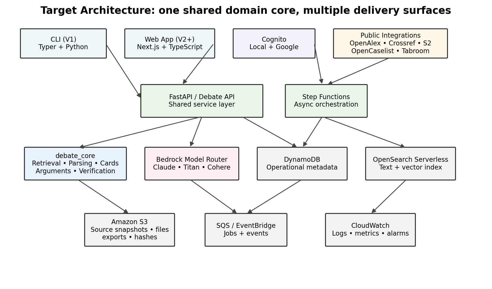
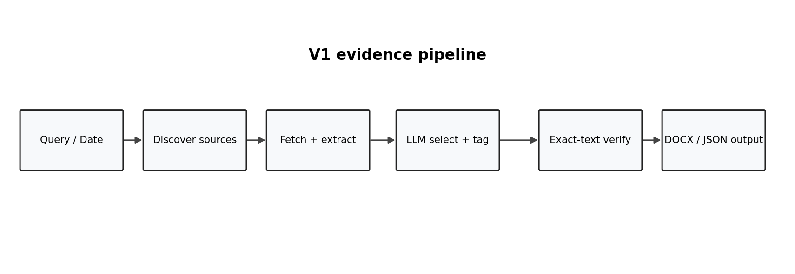
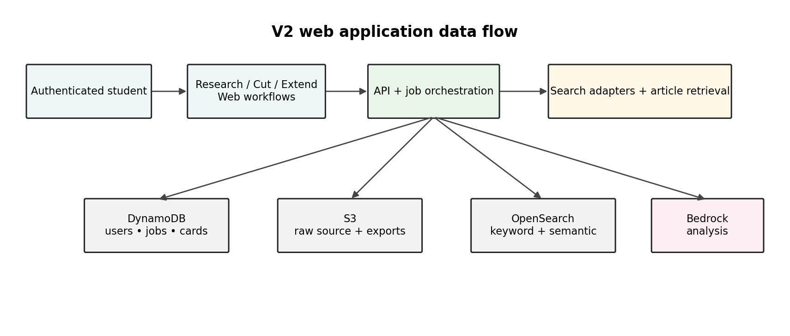
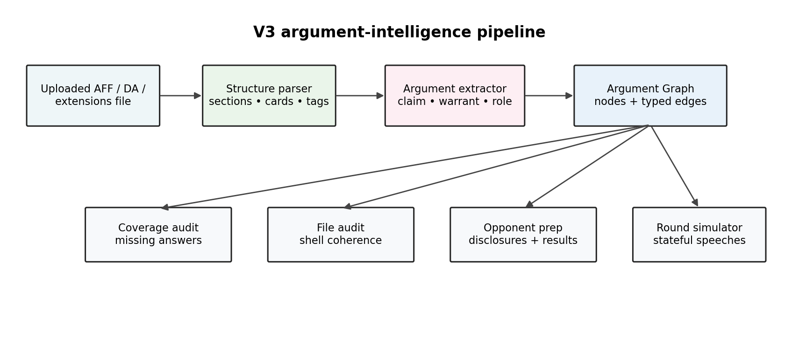
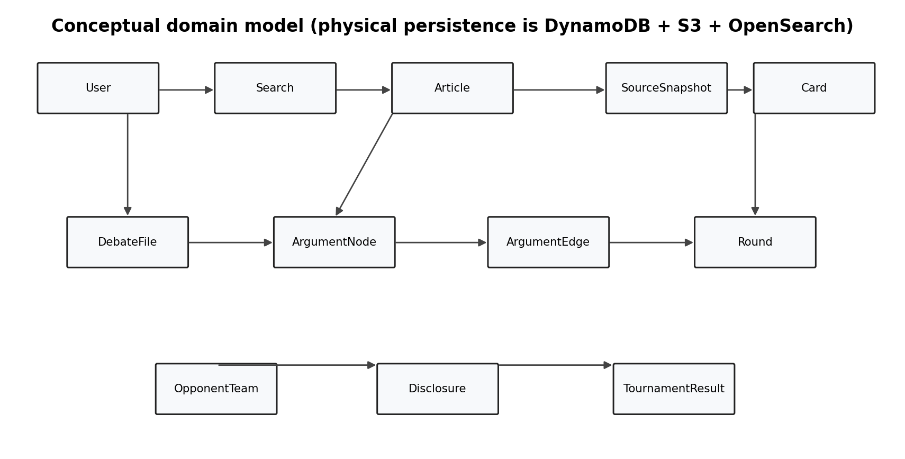

**DEBATE RESEARCH & ARGUMENT INTELLIGENCE PLATFORM**

**V1–V3 System Architecture Proposal**

*A durable architecture for evidence research, card cutting, argument
intelligence, opponent scouting, and round simulation*

Prepared for product planning and implementation • September 2026

# 1. Executive Summary

This proposal defines a single architecture that can support three
planned product generations without requiring a rewrite of the core
evidence pipeline. V1 is a command-line research and card-cutting MVP.
V2 exposes the same capabilities through an authenticated web
application and adds scholarly/news search, URL-to-card generation,
saved evidence, and in-round card extensions. V3 adds structured
argument intelligence: case coverage analysis, file auditing, opponent
intelligence, cross-examination, and full round simulation.

| **Primary architectural rule:** V1 must create reusable domain services, schemas, and verification primitives rather than embedding business logic inside CLI commands. The CLI, web API, and future agents are delivery surfaces over the same debate_core package. |
|----------------------------------------------------------------------------------------------------------------------------------------------------------------------------------------------------------------------------------------------------------------------|

The recommended stack is Python for the domain, retrieval, LLM,
verification, and document-processing layers; TypeScript/Next.js for the
web client; AWS for cloud infrastructure; DynamoDB for operational
metadata; S3 for immutable source/file storage; OpenSearch Serverless
for lexical and vector retrieval; and Amazon Bedrock for
foundation-model inference. There is deliberately no Snowflake,
Redshift, or analytical warehouse in the proposed architecture.

# 2. Goals and Architectural Principles

- Evidence integrity first. The system may use LLMs to select, classify,
  tag, explain, and mark evidence, but quoted evidence must be extracted
  from a retrieved source and verified byte/character-equivalently after
  normalization.

- One domain core, multiple interfaces. CLI, REST API, web UI, batch
  jobs, and V3 agents all call the same application services.

- Provider adapters at every external boundary. Search providers,
  article extractors, LLMs, persistence, OpenCaselist, and Tabroom
  integrations are abstracted so a provider can change without changing
  domain logic.

- Async by default for slow work. Search aggregation, article retrieval,
  large-file parsing, embeddings, document export, and simulated-round
  turns are represented as jobs and can be orchestrated independently.

- Preserve original artifacts. Raw HTML/text, uploaded files, generated
  cards, and model decisions retain provenance, timestamps, hashes, and
  version identifiers.

- LLMs produce structured outputs. Every model call that drives
  application behavior returns validated Pydantic/JSON schemas rather
  than free-form text wherever practical.

- Debate semantics are first-class data. Cards, arguments, warrants,
  answers, turns, links, impacts, counterplans, kritiks, speeches, and
  round concessions are modeled explicitly instead of existing only as
  chunks in a vector store.

# 3. Version Roadmap and User Stories

## V1 — CLI Evidence Research MVP

| **User story**                                                          | **V1 capability**                                                                                                               |
|-------------------------------------------------------------------------|---------------------------------------------------------------------------------------------------------------------------------|
| As a debater, I can search by query and date.                           | Federated news/scholarly discovery through provider adapters; top candidate sources returned with metadata.                     |
| As a debater, I can automatically cut evidence from accessible sources. | Retrieve article, extract verbatim passage, generate tag/cite, identify warrant spans, verify against source, export DOCX/JSON. |
| As a debater, I can request specific research needs.                    | CLI flags such as --argument politics-da, --need uniqueness, --since, --until, --max-cards, and --format.                       |
| As a coach, I can trust that evidence was not invented.                 | Stored source snapshot, content hash, exact span offsets, verification status, and reproducible metadata.                       |

## V2 — Authenticated Research Workspace

| **User story**                                                                         | **V2 capability**                                                                                                                              |
|----------------------------------------------------------------------------------------|------------------------------------------------------------------------------------------------------------------------------------------------|
| As a student, I can log in with email/password or Google.                              | Amazon Cognito user pool with local credentials and Google federation.                                                                         |
| As a student, I can enter a query and receive ten strong scholarly/noteworthy results. | Federated discovery, deduplication, lexical/vector retrieval, quality features, reranking, and transparent result rationales.                  |
| As a student, I can paste an article URL and receive a fully formatted card.           | URL retrieval → extraction → source metadata → tag/cite → evidence spans → underlining → verification → editor/export.                         |
| As a student, I can paste a debate card and receive extension bullets.                 | Claim/warrant/internal-link extraction plus card-grounded explanation; strategic inferences are labeled separately from text-supported claims. |
| As a student, I can save, edit, and export evidence.                                   | Card library, rich-text editor with provenance constraints, DOCX export, copy-as-rich-text, and source links.                                  |

## V3 — Argument Intelligence and Round Simulation

| **User story**                                                  | **V3 capability**                                                                                                                                                         |
|-----------------------------------------------------------------|---------------------------------------------------------------------------------------------------------------------------------------------------------------------------|
| Upload an affirmative and predict likely on/off-case positions. | Parse plan/advantages/cards; combine argument archetypes, public disclosures, and semantic similarity to generate likely positions with explanations.                     |
| Upload extensions and identify coverage gaps.                   | Build argument graph; map ANSWERS/TURNS/MITIGATES edges; flag predicted arguments with no supported response.                                                             |
| Simulate cross-examination and a full round.                    | Stateful round engine using format, judge type, experience level, delivery speed, and opponent strategy settings.                                                         |
| Upload a DA file and audit the 1NC shell.                       | Compare shell cards against the file; test uniqueness/link/internal-link/impact coherence; suggest stronger in-file evidence and optionally newer external evidence.      |
| Enter opponent/team names and build a scouting report.          | Use public OpenCaselist data and public/authorized Tabroom results to summarize disclosed positions and historical results; retain source links and retrieval timestamps. |

# 4. Technology Stack

| **Layer**              | **Technology**               | **Rationale**                                                                                                                                           |
|------------------------|------------------------------|---------------------------------------------------------------------------------------------------------------------------------------------------------|
| Primary language       | Python 3.12+                 | Best fit for retrieval, document processing, LLM orchestration, data parsing, and the existing CLI concept. Shared Pydantic domain models reduce drift. |
| CLI                    | Typer + Rich                 | Typed commands, good help text, tables/progress display, and straightforward packaging through uv.                                                      |
| Web frontend           | Next.js + TypeScript + React | Mature authenticated web UX, strong component ecosystem, and clean separation from the Python backend.                                                  |
| UI                     | Tailwind CSS + shadcn/ui     | Fast, accessible, consistent product UI without a large proprietary design system.                                                                      |
| API                    | FastAPI + Pydantic           | Typed REST/JSON contracts, OpenAPI generation, async support, and direct reuse of Python domain models.                                                 |
| Package management     | uv                           | Fast dependency resolution and workspace support; aligns with the preferred Python workflow.                                                            |
| Containers             | Docker + Amazon ECS/Fargate  | Longer-running extraction, rendering, and agent jobs do not need to fit Lambda limits; Fargate avoids server management.                                |
| Infrastructure as code | Terraform                    | Repeatable dev/stage/prod environments and explicit control of AWS resources.                                                                           |
| CI/CD                  | GitHub Actions + ECR         | Test, lint, build containers, push images, and deploy from version-controlled workflows.                                                                |

# 5. AWS Cloud Architecture

| **Service**                  | **Role**                                                                                                                | **Introduced**                        |
|------------------------------|-------------------------------------------------------------------------------------------------------------------------|---------------------------------------|
| Amazon Cognito               | User directory, password authentication, Google federation, JWT/OIDC tokens.                                            | V2                                    |
| Amazon ECS on Fargate        | FastAPI service and workers for article extraction, file parsing, export, and simulation jobs.                          | V2; local Docker in V1                |
| Amazon API Gateway           | Public API boundary, throttling, request authentication/authorization integration.                                      | V2                                    |
| AWS Step Functions           | Durable orchestration of multi-step jobs with retries/catches and inspectable state.                                    | V2                                    |
| Amazon SQS                   | Back-pressure and decoupling for extraction, embeddings, exports, and long-running analysis.                            | V2                                    |
| Amazon EventBridge           | Domain events, scheduled research jobs, and future notifications.                                                       | V2                                    |
| Amazon DynamoDB              | Primary operational database for users, jobs, searches, cards, files, arguments, rounds, and opponent metadata.         | V2; repository interface exists in V1 |
| Amazon S3                    | Raw source snapshots, uploaded files, generated DOCX, JSON manifests, hashes, and optional versioned immutable archive. | V1 optional cloud; V2 required        |
| Amazon OpenSearch Serverless | Full-text/BM25 search plus vector retrieval across articles, cards, files, and argument nodes.                          | V2                                    |
| Amazon Bedrock               | LLMs, embeddings, and reranking through a model-router abstraction.                                                     | V1 optional / V2+ standard            |
| AWS KMS / Secrets Manager    | Encryption keys and external provider secrets.                                                                          | V2                                    |
| CloudWatch / X-Ray           | Logs, metrics, alarms, tracing, token/cost telemetry, job diagnostics.                                                  | V2                                    |

# 6. Repository and Service Boundaries

The codebase should be a monorepo or tightly coordinated multi-package
repository. Domain logic must not import AWS SDKs directly. AWS-specific
implementations live behind ports/interfaces so the same use cases run
locally during V1 and in cloud workers during V2/V3.

repo/  
packages/  
debate_core/  
domain/ \# Pydantic entities and enums  
application/ \# use cases / services  
retrieval/ \# article + source abstractions  
evidence/ \# cutting, spans, verification  
arguments/ \# graph extraction and coverage  
rounds/ \# round state machine  
integrations/ \# provider interfaces  
debate_cli/ \# Typer commands; no business logic  
debate_api/ \# FastAPI routes; no business logic  
debate_workers/ \# async job handlers  
web/ \# Next.js application  
infrastructure/ \# Terraform  
tests/  
fixtures/  
golden_cards/  
integration/

## Core application services

| **Service**             | **Responsibilities**                                                                                             |
|-------------------------|------------------------------------------------------------------------------------------------------------------|
| SearchService           | Query expansion; provider fan-out; normalization; deduplication; ranking; source-quality metadata.               |
| ArticleService          | Fetch, canonicalize, extract readable text, persist source snapshot, detect paywall/retrieval failures.          |
| CardService             | Select passage, create tag/citation, mark warrants, verify exact evidence, save/export card.                     |
| CitationService         | Resolve author, title, publisher, date, URL, accessed date, credentials when verifiable.                         |
| FileIntelligenceService | Parse uploaded debate documents into sections/cards/arguments; preserve formatting metadata.                     |
| ArgumentGraphService    | Create argument nodes/edges and run coverage/coherence queries.                                                  |
| RoundSimulationService  | Maintain speech/CX/flow state; select strategies; generate opponent turns; evaluate from configured judge model. |
| OpponentIntelService    | Resolve teams/debaters; ingest public disclosure/results; summarize only sourced information.                    |
| ExportService           | Generate DOCX/rich-text/JSON while preserving markup and provenance.                                             |

# 7. Data Architecture

DynamoDB is the system of record for operational entities and
relationships. S3 is the system of record for large or immutable blobs.
OpenSearch is a derived index and can be rebuilt from DynamoDB/S3. This
prevents a search index from becoming an authoritative store and
eliminates the need for a data warehouse.

## Key domain models

| **Entity**       | **Key fields / concepts**                                                                                                                      |
|------------------|------------------------------------------------------------------------------------------------------------------------------------------------|
| User             | user_id, cognito_sub, email_hash, role, organization_id, created_at, settings                                                                  |
| Search           | search_id, user_id, query, filters, provider_set, created_at, status                                                                           |
| SearchResult     | search_id, article_id, rank, lexical_score, semantic_score, rerank_score, source_quality_features                                              |
| Article          | article_id, canonical_url, title, authors, publication, published_at, source_type, access_status                                               |
| SourceSnapshot   | snapshot_id, article_id, s3_key, retrieved_at, sha256, extractor_version, normalized_text_hash                                                 |
| Card             | card_id, owner_id, article_id, snapshot_id, tag, citation, evidence_text, verification_status, format_profile, revision                        |
| CardSpan         | card_id, span_id, start_offset, end_offset, style=underline/highlight, purpose=claim/warrant/internal_link/impact                              |
| DebateFile       | file_id, owner_id, filename, format, s3_key, sha256, parser_version, parsed_status                                                             |
| ArgumentNode     | node_id, file_id, side, argument_type, claim, warrant_summary, card_ids, section_path, confidence                                              |
| ArgumentEdge     | from_node, to_node, relationship_type, rationale, confidence; types include SUPPORTS, ANSWERS, TURNS, MITIGATES, CONTRADICTS, SOLVES, LINKS_TO |
| Round            | round_id, owner_id, format, judge_profile, speed, opponent_profile, status, current_speech                                                     |
| RoundEvent       | round_id, sequence, event_type, speaker, content, argument_refs, concessions, timestamp                                                        |
| OpponentTeam     | team_id, school, team_code, debater_names, external_ids, last_refreshed_at                                                                     |
| Disclosure       | team_id, source, season, round_or_file, side, positions, source_url, retrieved_at                                                              |
| TournamentResult | team_id, tournament, event, round, side_if_public, result, opponent, source_url, retrieved_at                                                  |

## DynamoDB physical strategy

Use a small number of single-table designs rather than one table per
entity. The exact partition/sort keys should be validated against access
patterns before implementation; a recommended initial split is:

- AppTable — users, searches, cards, jobs, files, rounds, and user-owned
  resources. PK patterns such as USER#\<id\>, CARD#\<id\>, ROUND#\<id\>;
  GSIs for lookup by status/date and external identifiers.

- ArgumentTable — argument nodes and adjacency edges.
  PK=GRAPH#\<file-or-case-id\>; SK=NODE#... or
  EDGE#\<from\>#\<relationship\>#\<to\>. Secondary indexes support
  node-type and claim lookup.

- OpponentTable — normalized team/debater identities, disclosure
  records, and tournament results with explicit source provenance.

- Use optimistic concurrency/revision fields on cards and parsed files
  so model reprocessing cannot silently overwrite student edits.

| **Future graph database:** Do not introduce Amazon Neptune in V1/V2. Define a GraphRepository interface now. If V3 graph traversals become complex enough that DynamoDB adjacency queries are limiting, a Neptune implementation can be added without changing the application layer. |
|---------------------------------------------------------------------------------------------------------------------------------------------------------------------------------------------------------------------------------------------------------------------------------------|

# 8. Evidence Integrity and Provenance

Evidence integrity is the platform’s central differentiator. A model may
identify useful spans but must never invent or paraphrase quoted
evidence. The card generator therefore uses source offsets and
deterministic verification.

1.  Retrieve the accessible source and save the raw response and cleaned
    text as a versioned SourceSnapshot.

2.  Normalize text deterministically (Unicode normalization, whitespace
    rules, preserved paragraph boundaries) and compute SHA-256 hashes.

3.  Ask the model for paragraph IDs or character spans plus structured
    tag/citation/markup metadata—not rewritten evidence.

4.  Extract the evidence directly from the saved snapshot.

5.  Verify that the generated card evidence can be reconstructed from
    the snapshot under the same normalization rules.

6.  Persist the snapshot ID, offsets, hashes, extractor/model versions,
    and verification status on the card.

7.  On export, render underlining/highlighting from CardSpan records.
    Student edits to quoted evidence are restricted to deletion/markup
    or explicit bracketed interpolation.

| **Hard failure rule:** If the source cannot be retrieved, the selected span cannot be reproduced, or metadata cannot be verified, the system must mark the card as unverified and must not present it as a finished evidence card. |
|------------------------------------------------------------------------------------------------------------------------------------------------------------------------------------------------------------------------------------|

# 9. Search and Retrieval Architecture

## Discovery adapters

Search is federated. The first release should prioritize sources with
low/no API cost and strong metadata, then allow additional commercial
providers through the same interface.

| **Provider class**     | **Examples / purpose**                                                                        | **Notes**                                                                                                |
|------------------------|-----------------------------------------------------------------------------------------------|----------------------------------------------------------------------------------------------------------|
| Scholarly discovery    | OpenAlex, Crossref, Semantic Scholar                                                          | Find papers, citations, authors, publication metadata, identifiers, and open-access links where exposed. |
| News/current discovery | Publisher RSS/Atom, Google News RSS where appropriate, GDELT or another configured provider   | Discovery only; article text is retrieved from the publisher/source URL when permitted.                  |
| Policy/government      | Congressional, agency, court, think-tank, university, and organization feeds/search endpoints | High-value debate sources; adapters can be added by topic.                                               |
| Opponent data          | OpenCaselist API; Tabroom public results/authorized data                                      | Separate from general article search; always preserve source URLs and timestamps.                        |

## Ranking pipeline

Candidate results are normalized and deduplicated by DOI, canonical URL,
title/author similarity, and source identifiers. Ranking uses
deterministic retrieval features before an LLM is asked to explain or
classify the result.

provider results  
-\> normalize / dedupe  
-\> lexical relevance (BM25)  
-\> semantic similarity (embeddings)  
-\> source-quality + recency features  
-\> Cohere Rerank (top N)  
-\> optional Claude rationale/classification  
-\> top 10

Source quality should be represented as features, not a hidden “truth
score.” Examples include peer-reviewed status, publication type, author
affiliation/credentials when verified, citation count for scholarship,
direct reporting vs. opinion, recency, accessibility, and whether the
article explicitly contains the requested causal relationship. The
interface should explain why a result is relevant without declaring a
politically preferred source.

# 10. LLM and Retrieval Model Strategy

All model calls go through a ModelRouter interface. Model IDs and
routing policy are configuration, not hard-coded business logic. This
prevents a future Bedrock model upgrade from forcing changes throughout
the application.

| **Task class**                          | **Recommended Bedrock model**          | **Use**                                                                                                                                         |
|-----------------------------------------|----------------------------------------|-------------------------------------------------------------------------------------------------------------------------------------------------|
| Complex reasoning / argument analysis   | Anthropic Claude Sonnet 5              | Card tagging; argument graph extraction; case/coverage analysis; coherent speech planning; judge/RFD reasoning.                                 |
| High-volume extraction / classification | Anthropic Claude Haiku 4.5             | Metadata cleanup, relevance classification, card structure detection, lightweight claim/warrant labeling where benchmark quality is sufficient. |
| Optional deep offline audit             | Anthropic Claude Opus 5 (or successor) | Expensive, low-frequency file/strategy audits if evaluations show materially better results; not required for normal requests.                  |
| Embeddings                              | Amazon Titan Text Embeddings V2        | Semantic search for article chunks, cards, file sections, and argument nodes.                                                                   |
| Reranking                               | Cohere Rerank 3.5                      | Reorder top lexical/vector candidates before returning search results or retrieval context.                                                     |

## Structured model contracts

Representative Pydantic outputs should include CardSelection,
CitationMetadata, MarkupSpan, ArgumentNodeExtraction,
ArgumentEdgeExtraction, CoverageFinding, FileAuditFinding, CXQuestion,
SpeechPlan, RoundDecision, and SearchResultRationale. Each schema
carries confidence, source references, and validation errors where
appropriate.

## Prompt/version governance

- Every production prompt has a prompt_id and semantic version.

- Persist model_id, inference profile/region, prompt version,
  temperature, and relevant retrieval IDs for important generated
  artifacts.

- Golden-file evaluations run before a prompt/model version is promoted.

- Argument intelligence outputs must retain links to supporting
  nodes/cards; unsupported strategic suggestions are labeled as
  inference.

# 11. V1 Detailed Architecture

## CLI commands

debate-research search "midterm elections" --since 2026-09-14
--max-results 20  
debate-research cut \<URL\> --format flow --output evidence.docx  
debate-research search "health insurance" --argument politics-da --need
link --auto-cut 10  
debate-research verify evidence.docx  
debate-research daily politics --date 2026-09-17

V1 should support local persistence through repository implementations
(filesystem + SQLite only if useful for local job metadata), but domain
entities and repository interfaces must match the future cloud model. If
S3/Bedrock credentials are configured, the same services can use cloud
implementations. The V1 package must not depend on a web framework.

## V1 acceptance criteria

- At least one scholarly source adapter and one current-news/RSS adapter
  work through the common SearchProvider interface.

- Accessible URL → verified card works end to end with tag, cite,
  verbatim evidence, underlining, and DOCX export.

- No generated evidence can pass verification unless it is reproducible
  from a stored source snapshot.

- Golden-card tests verify exact text and formatting against
  representative debate cards.

- CLI output includes explicit retrieval/verification failures instead
  of silently fabricating metadata.

# 12. V2 Detailed Architecture

## Web workflows

### Research

Query fan-out creates a SearchJob. Results are deduplicated and ranked,
then the top ten are returned with source type, publication date, access
status, relevance rationale, and actions to open/cut.

### Cut a Card

URL submission creates a CardJob. Extraction and metadata resolution run
asynchronously. The editor loads only after evidence verification; if
retrieval fails or a paywall blocks access, the job returns an explicit
status.

### Extend a Card

The pasted/saved card is parsed into claim, warrant, internal link, and
impact components. Output can include 15-second and 30-second
extensions, cross-ex questions, and likely answers, but text-supported
claims and strategic inference are separated.

### Card Library

Saved cards retain revisions, source snapshot provenance, markup spans,
verification status, tags/folders, and generated extensions.

## Authentication and authorization

Cognito user pools provide local accounts and Google federation. API
Gateway/FastAPI validates tokens and maps claims to application roles
(student, coach, administrator). The application should use
tenant/organization IDs from V2 onward even if the first release is
single-user-oriented; this avoids redesign when teams or schools are
introduced.

# 13. V3 Detailed Architecture

## Argument graph

The argument graph is the V3 foundation. File parsing first identifies
structural units (headings, tags, citations, evidence, analytic blocks).
LLM extraction then creates typed nodes and edges. Vector embeddings aid
matching, but graph edges are explicit persisted assertions with source
references and confidence.

| **Node examples**                                                                                                                                         | **Edge examples**                                                                                   |
|-----------------------------------------------------------------------------------------------------------------------------------------------------------|-----------------------------------------------------------------------------------------------------|
| Plan, advantage, uniqueness claim, link, internal link, impact, counterplan, net benefit, kritik link, alternative, theory shell, analytic, evidence card | SUPPORTS, ANSWERS, TURNS, MITIGATES, CONTRADICTS, PREREQUISITE, LINKS_TO, SOLVES, IMPACTS, PERMUTES |

## Coverage analysis

Likely opponent positions are generated from argument archetypes plus
retrieval from public disclosure/history and similarity to known cases.
The system maps the student’s extension nodes against those positions. A
gap is not “the AI did not see a keyword”; it is a predicted argument
node for which no sufficiently supported ANSWERS/TURNS/MITIGATES
relationship exists.

## File auditing

For a disadvantage file, the system identifies the intended shell
structure and compares each 1NC card with alternatives already in the
file using directness, recency, qualification metadata, warrant density,
specificity, and logical fit. It should explain tradeoffs instead of
assigning opaque overall scores. Coherence checks detect missing or
mismatched steps between uniqueness, link, internal link, and impact.

## Round simulator

The simulator is a state machine, not a single chat thread. Every speech
or CX answer creates a RoundEvent and updates flow state, concessions,
unresolved arguments, time, and strategic options. Format-specific rules
define speech order, timing, partner/team structure, cross-ex style, and
evaluation constraints for Policy, Lincoln-Douglas, and Public Forum.

| **Judge setting**    | **Behavioral effect**                                                                                                                                    |
|----------------------|----------------------------------------------------------------------------------------------------------------------------------------------------------|
| Lay                  | Prioritize clarity, story, explained impacts, and accessible persuasion; technical arguments matter only when clearly developed.                         |
| Somewhat experienced | Track conventional positions and line-by-line reasonably well, but penalize unexplained jargon and highly technical theory.                              |
| Experienced flow     | Track concessions/drops precisely; evaluate comparative warrants, offense/defense, and explicit ballot framing.                                          |
| Circuit/technical    | Permit advanced strategy and dense line-by-line; still require the simulator to justify decisions from the recorded flow rather than stereotype a judge. |

## Opponent intelligence

Opponent intelligence uses only public or explicitly authorized data.
OpenCaselist has a documented API that exposes caselists, schools,
teams, rounds, cites, downloads, search, and Tabroom-linked resources.
Tabroom documents public tournament and circuit results, including
team/entry success tables. The integration should prefer
documented/public interfaces, respect terms and rate limits, and store
the original source URL plus retrieval time for every assertion.

# 14. Security, Privacy, and Student Safety

- Encrypt S3, DynamoDB, OpenSearch, and secrets using AWS-managed or
  customer-managed KMS keys; enforce TLS in transit.

- Use least-privilege IAM roles per API/workflow/worker. A user never
  receives general AWS credentials unless a specific future feature
  requires it.

- Keep uploaded files private by default. Generate short-lived signed
  URLs for download; never expose S3 buckets publicly.

- Minimize personally identifying student data. Store external
  team/debater names only when needed for opponent scouting and with
  source provenance.

- High-school users may be minors. Before school-wide deployment, obtain
  legal review for applicable privacy/education requirements (including
  COPPA for users under 13 and any FERPA obligations created by school
  relationships); do not assume a regulation applies merely because the
  product is educational.

- Do not bypass paywalls, access controls, robots restrictions where
  applicable, or authenticated Tabroom/OpenCaselist data without
  authorization.

- Add rate limits, abuse detection, audit logs, account deletion/export,
  and configurable retention before public launch.

# 15. Reliability, Observability, and Cost Controls

| **Concern**                   | **Design response**                                                                                                                |
|-------------------------------|------------------------------------------------------------------------------------------------------------------------------------|
| External source failures      | Provider-level timeouts/circuit breakers; retry only idempotent operations; fall back to other providers; surface partial results. |
| Slow article/file processing  | Async jobs through Step Functions/SQS; client polls or receives websocket/SSE status updates.                                      |
| LLM failure or malformed JSON | Schema validation + limited retry with repair prompt; fail closed for evidence integrity actions.                                  |
| Model cost                    | Task routing (Haiku vs Sonnet), context trimming, cache reusable analyses, batch embeddings, daily/user quotas, token telemetry.   |
| Search cost                   | Index only normalized reusable content; lifecycle/delete stale transient indices; avoid embedding the same snapshot repeatedly.    |
| Data loss                     | S3 versioning, DynamoDB point-in-time recovery/backups, export manifests, infrastructure-as-code.                                  |
| Debugging                     | Correlation/job IDs across API, Step Functions, workers, Bedrock calls, and source retrieval; structured logs in CloudWatch.       |

# 16. Testing and Evaluation Strategy

## Deterministic tests

- Unit tests for normalization, canonical URLs, citation formatting,
  hash generation, text-span reconstruction, and argument graph queries.

- Golden DOCX fixtures based on representative debate-card formatting:
  headings/tags, citation blocks, underlined warrants, highlighted
  critical phrases, and long evidence passages.

- Integration tests for each SearchProvider and external API adapter
  using recorded fixtures to avoid unstable CI.

- Contract tests for Pydantic model outputs and repository interfaces.

## LLM evaluations

- Card selection: relevance, completeness of warrant, and zero
  unsupported evidence text.

- Underlining: precision/recall against coach-labeled warrant spans.

- Argument extraction: node-type accuracy, edge accuracy, and support
  citation accuracy.

- Coverage analysis: false-negative rate on known missing answers is
  more important than producing a long list of speculative threats.

- Round simulation: strategic consistency across speeches, correct use
  of CX concessions, accurate flow/drop tracking, and RFD traceability.

- Model upgrades require an evaluation comparison before promotion;
  “newer model” is not itself sufficient.

# 17. Deployment and Evolution Plan

| **Phase**   | **Deliverable**                                                                                            | **Architecture guardrail**                                                                  |
|-------------|------------------------------------------------------------------------------------------------------------|---------------------------------------------------------------------------------------------|
| Foundation  | debate_core domain models, provider interfaces, source snapshot + verifier, card renderer.                 | No CLI-specific business logic; no AWS SDK imports in domain/application layer.             |
| V1 MVP      | Typer CLI, free/low-cost discovery adapters, accessible article extraction, Bedrock optional, DOCX export. | Use the same schemas and repository contracts intended for V2.                              |
| V2 platform | Next.js, Cognito, FastAPI, DynamoDB, S3, OpenSearch, Step Functions/SQS, card library.                     | Migrate by swapping repository/provider implementations, not rewriting use cases.           |
| V3.0–3.2    | File parser, argument graph, coverage analysis, DA/case auditing.                                          | GraphRepository abstraction; persist nodes/edges with explicit source refs.                 |
| V3.3–3.4    | Opponent intelligence integrations.                                                                        | Public/authorized data only; provider-specific adapters and provenance.                     |
| V3.5–3.7    | CX and round simulator; opponent-informed simulation.                                                      | Round state machine + format/judge policy modules; no stateless “chat-only” implementation. |

# 18. Key Architecture Decisions (ADRs)

| **Decision**                                                      | **Choice**                               | **Why**                                                                                                   |
|-------------------------------------------------------------------|------------------------------------------|-----------------------------------------------------------------------------------------------------------|
| [ADR-001](../adr/0001-python-domain-core.md)                      | Python domain core                       | Maximizes reuse across CLI, document parsing, retrieval, LLM, and API workers.                            |
| [ADR-002](../adr/0002-dynamodb-operational-store.md)              | DynamoDB operational store               | Serverless, scalable, no warehouse dependency; access-pattern-driven design fits card/file/job workloads. |
| [ADR-003](../adr/0003-s3-source-of-truth-for-raw-artifacts.md)    | S3 source-of-truth for raw artifacts     | Cheap durable storage, versioning/hashes, separates blob lifecycle from metadata.                         |
| [ADR-004](../adr/0004-opensearch-is-derived-not-authoritative.md) | OpenSearch is derived, not authoritative | Enables BM25/vector retrieval without risking data loss if an index is rebuilt.                           |
| [ADR-005](../adr/0005-bedrock-behind-model-router.md)             | Bedrock behind ModelRouter               | AWS-native credentials/governance while preserving model portability.                                     |
| [ADR-006](../adr/0006-exact-source-evidence-verification.md)      | Exact-source evidence verification       | LLM can select but cannot author quoted evidence.                                                         |
| [ADR-007](../adr/0007-argument-graph-before-simulator.md)         | Argument graph before simulator          | Coverage, auditing, round state, and opponent prep all depend on structured debate semantics.             |
| [ADR-008](../adr/0008-no-neptune-initially.md)                    | No Neptune initially                     | DynamoDB adjacency is sufficient until V3 proves a need for complex graph traversal.                      |
| [ADR-009](../adr/0009-async-job-architecture.md)                  | Async job architecture in V2             | Prevents article/file/LLM latency from coupling directly to browser request lifetimes.                    |

# 19. Risks and Mitigations

| **Risk**                              | **Mitigation**                                                                                                                                                               |
|---------------------------------------|------------------------------------------------------------------------------------------------------------------------------------------------------------------------------|
| Publisher blocking/paywalls           | Do not bypass controls. Prefer accessible sources and return retrieval status; allow manual pasted text only if the user has lawful access and clearly mark provenance mode. |
| External API changes                  | Adapter layer, contract tests, provider health metrics, and graceful fallback.                                                                                               |
| Hallucinated citations/qualifications | Resolve metadata separately; every cited field has provenance and a verified/unverified state.                                                                               |
| Weak argument predictions             | Label predictions and rationale; combine archetypes with actual disclosed positions; show confidence rather than presenting guesses as facts.                                |
| Simulator teaches bad debate habits   | Use coach-curated evaluation sets, transparent flow/RFD, configurable difficulty, and distinguish evidence-supported claims from strategic inference.                        |
| Opponent data privacy/ethics          | Limit to public or authorized data, no private-account circumvention, retain source links, and allow administrative removal where appropriate.                               |
| Costs grow with usage                 | Model routing, quotas, cached embeddings/analysis, async batching, and per-feature cost telemetry.                                                                           |

# 20. Recommended V1 Implementation Order

1\. Create debate_core domain models (Article, SourceSnapshot, Card,
CardSpan, SearchResult) and repository/provider interfaces.

2\. Implement deterministic source normalization, SHA-256 provenance,
and evidence verification before adding an LLM.

3\. Implement article retrieval/extraction (httpx + trafilatura) with
explicit inaccessible/paywall states.

4\. Implement scholarly and news/RSS SearchProvider adapters; normalize
and deduplicate results.

5\. Add Bedrock ModelRouter, structured CardSelection/MarkupSpan
outputs, and low-cost/high-quality routing.

6\. Implement citation resolution and verified author/publication
metadata.

7\. Implement DOCX renderer modeled on the supplied debate-card
conventions, plus JSON manifest export.

8\. Add Typer CLI commands and local repository implementations.

9\. Build golden-card tests and end-to-end fixtures.

10\. Only after the V1 core is stable, add AWS persistence
implementations and begin V2 web/API work.

# 21. External Service Assumptions and References

The following current service capabilities informed this proposal. They
should be revalidated during implementation because provider APIs and
model catalogs change.

**1. Amazon Bedrock — model availability and compatibility:**
https://docs.aws.amazon.com/bedrock/latest/userguide/models.html

**2. Amazon Bedrock — Anthropic model catalog:**
https://docs.aws.amazon.com/bedrock/latest/userguide/model-cards-anthropic.html

**3. Amazon Bedrock — Titan Text Embeddings V2:**
https://docs.aws.amazon.com/bedrock/latest/userguide/titan-embedding-models.html

**4. Amazon Bedrock — Cohere models / reranking:**
https://docs.aws.amazon.com/bedrock/latest/userguide/model-cards-cohere.html

**5. Amazon Cognito — user pools and external identity providers:**
https://docs.aws.amazon.com/cognito/latest/developerguide/cognito-user-pools-identity-provider.html

**6. Amazon ECS — AWS Fargate:**
https://docs.aws.amazon.com/AmazonECS/latest/developerguide/AWS_Fargate.html

**7. Amazon OpenSearch Serverless:**
https://docs.aws.amazon.com/opensearch-service/latest/developerguide/serverless-overview.html

**8. Crossref REST API:**
https://www.crossref.org/documentation/retrieve-metadata/rest-api/

**9. Semantic Scholar Academic Graph API:**
https://api.semanticscholar.org/api-docs/

**10. OpenAlex Help/API reference:** https://help.openalex.org/

**11. OpenCaselist API v1:** https://api.opencaselist.com/

**12. Tabroom public results documentation:**
https://docs.tabroom.com/public/public-results

# 22. Final Recommendation

Proceed with V1, but treat it as the first client of the permanent
domain platform. The non-negotiable foundation is debate_core plus
source provenance, exact-text verification, provider interfaces, typed
model contracts, and persistence abstractions. If those boundaries are
established now, V2 is primarily the addition of identity, cloud
persistence/search, asynchronous orchestration, and a web UI; V3 then
adds structured argument graphs and a stateful simulation engine rather
than forcing a redesign of evidence research.

The highest-risk architectural mistake would be to build V1 as a
monolithic scraping script that prompts an LLM and writes a DOCX. The
recommended architecture intentionally separates discovery, retrieval,
source preservation, model analysis, deterministic verification, domain
persistence, and rendering so each capability can be reused by the web
application and by future agents.
